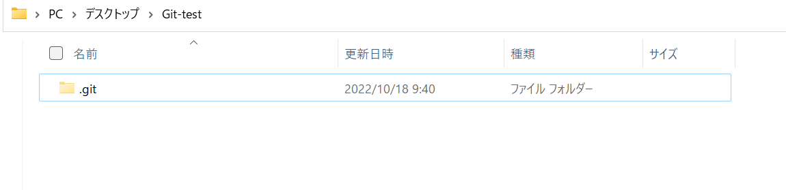

## ローカルリポジトリを作成してみる

ここでは git コマンドを使用して実際にリポジトリを作成する方法について学びます
今回はpowershellベースでやりますが、ほかのコマンドラインでも実行可能です。

手順は以下の通りです。


### 1, ローカルリポジトリを作る

1. デスクトップに任意の名前の新しいフォルダーを作成します 。
今後のためにコマンドライン上でやることを推奨します

``` powershell
mkdir Git-test
```

2. 作成したフォルダーに移動して以下のコマンドを使ってリポジトリとして登録します

``` powershell
cd Git-test

git init
```

隠しファイルの`.git`フォルダーが作成されます。



これでローカルリポジトリとして登録されたことになります。

※隠しファイルが表示されない場合はエクスプローラーの設定が原因の可能性があります
エクスプローラーを開き `表示`-> `隠しファイル`のチェックをオンにしてください

### 2, 基本設定

ローカルリポジトリを作ったらgitに必要な基本設定を行います

1. 先ほど作ったローカルリポジトリをエディターで開き`.gitignore`ファイルを作成します

2. testというフォルダーを新しく作成します。

3. `.gitignore`ファイルの中に先ほど作ったフォルダーの名前を入力します


    `.gitignore`に書かれたフォルダーやファイルはgithubにpushされることを防ぐことができます。
    以下の画像のように`test`フォルダーの文字の色が薄くなります

    


    基本的にほとんどのプログラミング言語には`.gitignore`のテンプレートファイルが存在しています。
    設定の仕方はいくつか方法があり`02create_remote-repo.md`, `03local_local_to_remote.md`で説明します

4. オープンソースライセンスを設定します。新しいファイルを作成して`LICENSE`または`LICENSE.md`と入力をします

    空のファイルができますが今はそれで大丈夫です。
    ライセンスの設定はいくつか方法があり`02create_remote-repo.md`, `03local_local_to_remote.md`で説明をします
