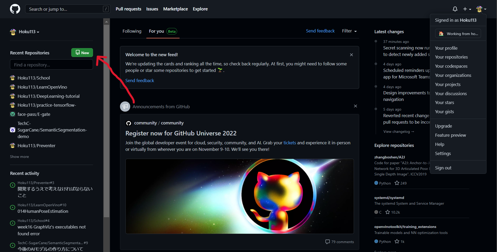
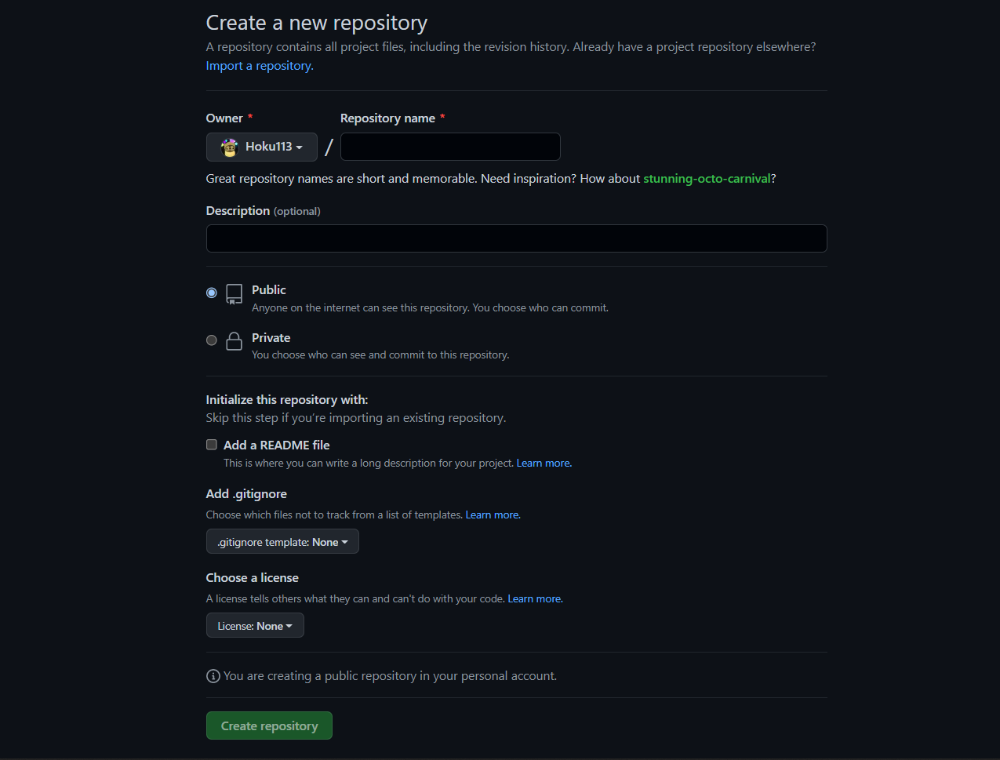
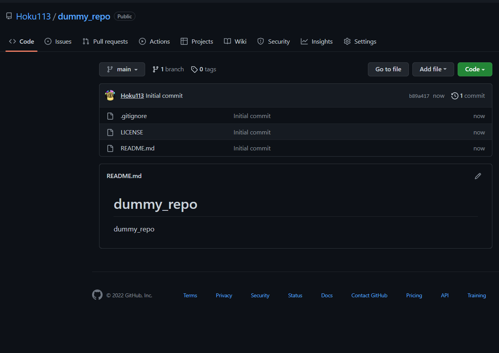
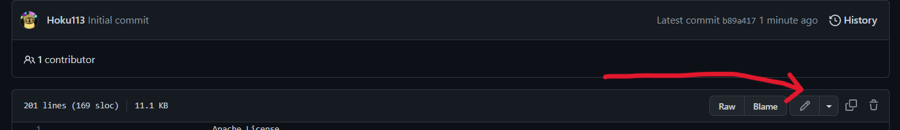
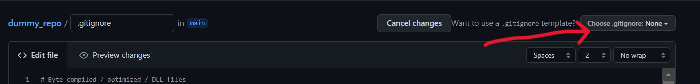
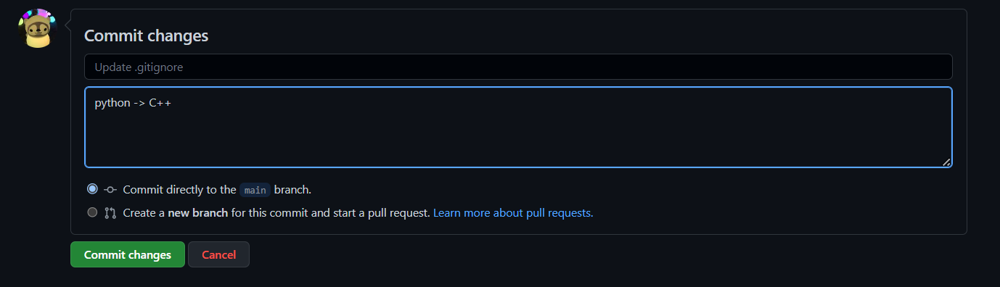

## リモートリポジトリを作成してみる

ここではGitHubベースでのリポジトリの作成を行います。

※このチュートリアルではGitHubアカウントを持っていることを前提としています。
まだアカウントを作っていない人はのサインアップ
を行ってください

### 1, GitHubでリポジトリを作成してみる

1. GitHubアカウントでサインインします

2. ホームの左側にある"new"のボタンをクリックするとリポジトリの作成する画面に切り替わります

3. 入力欄について上から説明していきます

※()内に書かれているのはこのデモで使用している名前

- Repository name: 一意リポジトリの名前を入力します 
(`dummy_repo`)

- Description: このリポジトリの説明を任意で書くことができます
(`dummy_repo`)

- public or private: 全ての人がこのリポジトリを閲覧できるか、一部の人が閲覧できるかを設定できます
(`public`)

- Add a README file: このリポジトリにREADMEファイルを追加するかどうかを選択できます

- Add .gitignore: .gitignoreファイルを追加するかどうか選択できます
(ここでは`python`を選択しています)

- Choose a license: オープンソースライセンスを選択することができます
(ここでは`Appache-license2.0`を選択しています)

終わったら `Create repository`をクリックするとリポジトリが作成されます

### 2, リポジトリの中で.gitignoreファイルを変更する

1. 先ほど作ったリポジトリの `.gitignore`ファイルをクリック

2. 以下の画像のマークをクリックして`Edit`を選択

3. 画像の`Choose .gitignore`をクリックして新しいテンプレートを選択します
   今回はC++に設定しています

4. ページの下にスクロールをして、コミット名とコメントを入力して`commit changes`をクリック

※1　ブランチを切り替えてコミットしたい場合、`Create a new branch ...`を選択する

※2 ライセンスのテンプレートも上記と同じ方法で変更することが可能です。
