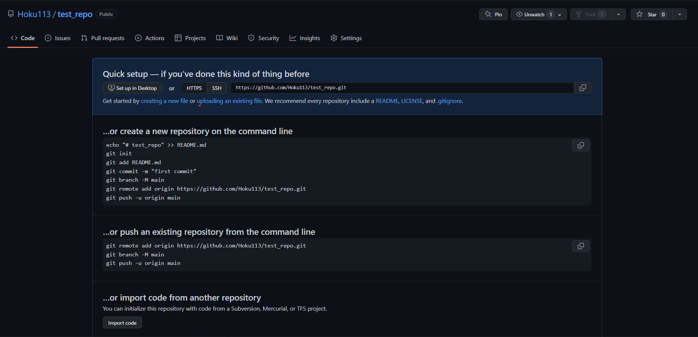
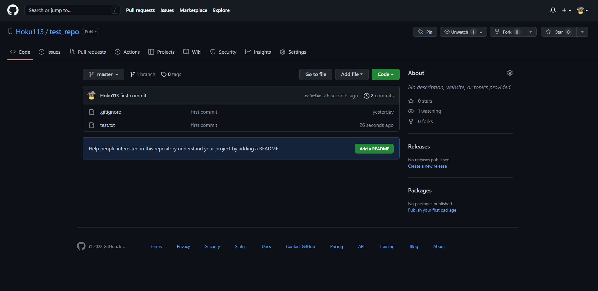

## ローカルリポジトリをリモートリポジトリにプッシュする


ここでは[HandsOn01]で作成したローカルリポジトリをリモートリポジトリとして関連付けるための
操作方法について説明をしていきます。

※このリポジトリでは[HandsOn01](./01crate_local_repo.md)を完了していることが前提となっています
まだ完了していない人は先にこちらをやるようにしてください。

### 1, リモートリポジトリを作成する

1. GitHubで新しいリポジトリを作成します。構成は以下の通り

- Repository name: test_repo 

- Description: 任意

- public or private: public

- Add a README file: チェックなし

- Add .gitignore: チェックなし

- Choose a license: チェックなし

このような画面になるはずです。


できたらリポジトリのURLをコピーしておきます


### 2, ローカルリポジトリに変更を追加する

1. `test.txt`を作成し"Hello world"と入力します

2. [HandsOn01](./01crate_local_repo.md)で作成したローカルリポジトリに移動して以下のコマンドを実装します<br>
これによってローカルリポジトリとリモートリポジトリを紐づけることができます

```powershell
git remote add <name> <remote-repo-URL>
```

できたらちゃんと紐づけられているか確認しましょう。<br>
次のコマンドを使用します

```powershell
git remote -v
```
以下のような出力になります

```
<name> <remote-repo-URL> (fetch)
<name> <remote-repo-URL> (push)
```

3. gitコマンドを利用して変更を追加しコミットします

```powershell
git add .
git commit -m "<commit message>"
```

`git add .` で全ての変更をステージングします。<br>
変更のステージングはファイルやフォルダーごとに実装することが可能です。<br>
ファイルやフォルダーのステージングは以下のようになります

ファイル

```powershell
git add <file name>
```

フォルダー

``` powershell
git add <directory name>
```

4. コミットしたものをリモートリポジトリにプッシュします。<br>
以下のコマンドで実装をします

※1 `<name>`は `git remote add`の時に追加した名前 <br>
※2 `<branch name>` はローカルリポジトリを作成した時点でできています。(default: `master`)

```powershell
git push --set-upstream <name> <branch name>
```

GitHubに移動し変更が反映されているか確認します。
