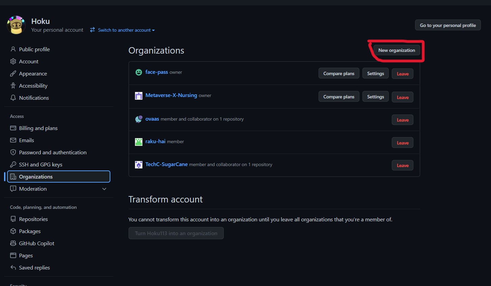
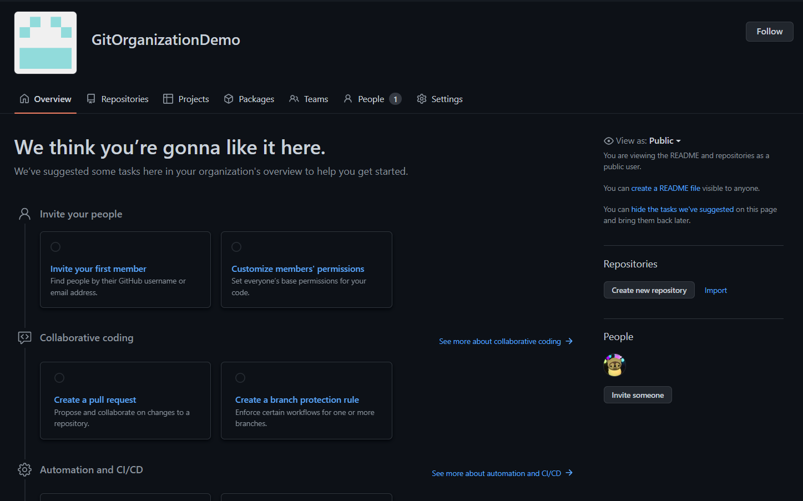

## Organizationについて

ここではGitHubにある一つの機能であるOrganizationについて説明していきます。

### 1, Organizationとは

複数のメンバーをまとめることができるグループ機能です。
グループLineや、discordのサーバーみたいなイメージです。

チームで開発を行う際などに使われることが多く、管理者は個々のメンバーの権限や管理などを行うことができます。
これに関しては次のセクションにて説明します

### 2, Organizationを作成してみる

実際にOrganizationを作成して見ます。
以下の順番通りに進めていきます。

1. GibHubにログインをして右上の自分のアイコンをクリックして`settings`を選択します

2. `Organization`-> `new Organization`を選択してプランを選択します。

Organizationのプランの詳細は[こちら](https://github.com/organizations/plan)

今回はFreeプランで作成します。`create a free organization`をクリックしてOraganizationを作成する画面に移行します

3. 以下の必須入力欄を埋めて検証を行い、利用規約に同意をしたら`Next`をクリックします

- Oraganization account name: Organizationの名前を入力します

- Contact email: Organization用のメールアドレスを入力します。作成者のメールアドレス、または組織で管理しているメールアドレスを記入します

- This organization belongs to: 作成する組織がどこに属しているかを選択します。企業に属していない場合は基本的に`My personal account`を選択します

4. Organizationにメンバーを招待します。入力欄に追加したいメンバーのgithubメールアドレスまたはユーザー名を入力して`Complete setup`を入力します

メンバーの招待は後で行うことができます。今メンバーの招待が必要じゃない方は `skip this step`をクリックします。

5. GitHubのアンケート？のような画面に移動します。(任意回答)
特に必要のない方は画面をスクロールして`submit`で送信します。

6. GitHubにOrganizationが作成されます。

